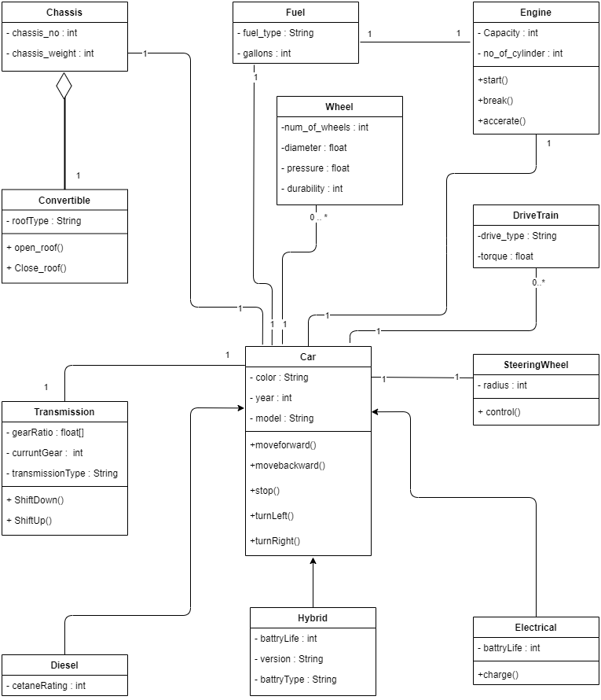

# Java_Automobile_project

This java project demonstrates the concepts such as encapsulation, inheritance, and polymorphism. The case study for this project is based on an automobile development where each component of the vehicle is represented by a class.

The class diagram for the project is follows.

